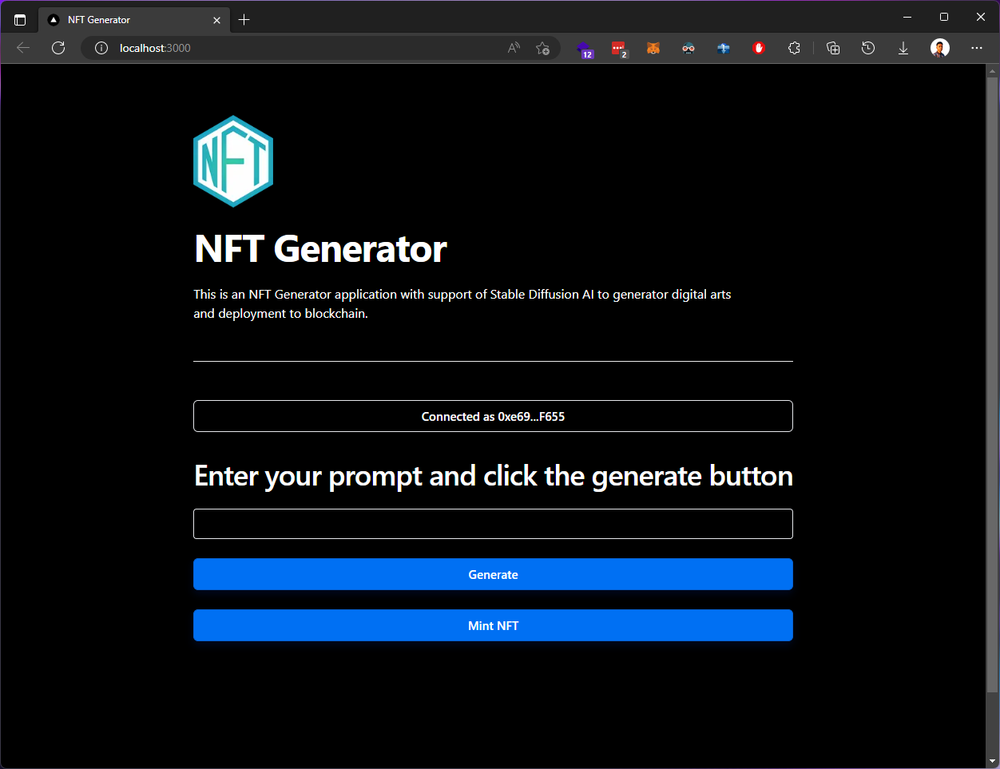

## NFT Generator
NFT Generator application with support of Stable Diffusion AI for digital arts generating.<br/>
[Under development]

First, install dependencies:
```bash
pnpm install
# or
yarn install
```

Then, run the development server:

```bash
pnpm run dev
# or
yarn dev
```

Open [http://localhost:3000](http://localhost:3000) with your browser to see the result.

